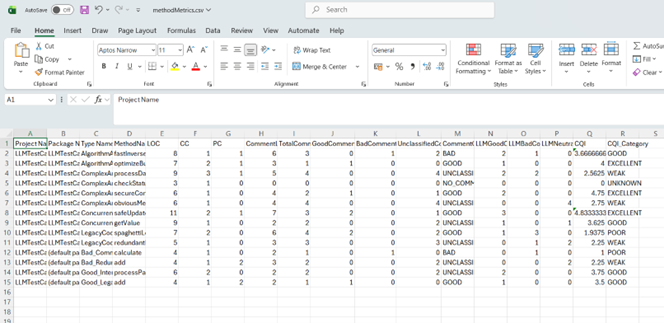

# DesigniteJava
DesigniteJava is a code quality assessment tool for code written in Java. It detects numerous design and implementation smells. It also computes many commonly used object-oriented metrics.

## Features
* Detects 17 design smells
	- Imperative Abstraction
	- Multifaceted Abstraction
	- Unnecessary Abstraction
	- Unutilized Abstraction
	- Deficient Encapsulation
	- Unexploited Encapsulation
	- Broken Modularization
	- Cyclic-Dependent Modularization
	- Insufficient Modularization
	- Hub-like Modularization
	- Broken Hierarchy
	- Cyclic Hierarchy
	- Deep Hierarchy
	- Missing Hierarchy
	- Multipath Hierarchy
	- Rebellious Hierarchy
	- Wide Hierarchy
* Detects 10 implementation smells
	- Abstract Function Call From Constructor
	- Complex Conditional
	- Complex Method
	- Empty catch clause
	- Long Identifier
	- Long Method
	- Long Parameter List
	- Long Statement
	- Magic Number
	- Missing default
* Computes following object-oriented metrics
	- LOC (Lines Of Code - at method and class granularity)
	- CC (Cyclomatic Complexity - Method)
	- PC (Parameter Count - Method)
	- NOF (Number of Fields - Class)
	- NOPF (Number of Public Fields - Class)
	- NOM (Number of Methods - Class)
	- NOPM (Number of Public Methods - Class)
	- WMC (Weighted Methods per Class - Class)
	- NC (Number of Children - Class)
	- DIT (Depth of Inheritance Tree - Class)
	- LCOM (Lack of Cohesion in Methods - Class)
	- FANIN (Fan-in - Class)
	- FANOUT (Fan-out - Class)
	
## ✨ New: Intelligent Comment Quality Analysis (CQI)
This version of DesigniteJava introduces an **AI-powered Comment Quality Index (CQI)**. It goes beyond simple metrics to evaluate the *meaning* and *usefulness* of your code documentation using Large Language Models (LLMs).

### Key CQI Features:
*   **Semantic Auditing**: Distinguishes between truly useful comments and those that are redundant, misleading, or noise.
*   **AI Classification**: Identifies warning comments, intent markers, and blocks of commented-out code.
*   **Context-Aware**: Evaluates comments in the context of the method body they describe.

### New Intelligence Metrics:
The `methodMetrics.csv` output now includes:
*   **LLMGood/Bad/Neutral**: Counts of comments validated by AI.
*   **CQI**: A numerical score (0.0 - 5.0) representing documentation health.
*   **CQI_Category**: Qualitative ratings (e.g., EXCELLENT, WEAK, POOR).


## Where can I get the latest release?
You may download the executable jar from the [Designite](https://www.designite-tools.com/products-dj) website.

## Compilation
We use maven to develop and build this application with the help of Eclipse IDE and libraries.
To create a runnable jar, run the following command in the directory where the repository is cloned:
```text
mvn clean install
```
If you use Eclipse: 
* open the project using Eclipse
* then right-click on the project name and select 'run as > maven install'

## Execute the tool
After the previous step is done:
* Open terminal/command line console and run the jar
```text
  java -jar Designite.jar -i <path of the input source folder> -o <path of the output folder>
  ```
**Note:** Make sure that the output folder is empty. Tool deletes all the existing files in the output folder.

### Enabling Intelligent Analysis (Optional)
To use the new LLM-powered features:
1. Set the **`GROQ_API_KEY`** environment variable.
2. Run the tool with the **`-llm`** flag to trigger the AI analysis pipeline.

**Run via Maven:**
```bash
mvn exec:java -Dexec.mainClass=Designite.Designite -Dexec.args="-i <input_path> -o <output_path> -llm"
```

**Example:**
```bash
mvn exec:java -Dexec.mainClass=Designite.Designite -Dexec.args="-i E:\Versions\TestProject\src\LLMTestCases -o E:\Versions\llm_version\DesigniteJava-master\output -llm"
```

### ⚠️ Notes and Limitations of CQI
*   **API Dependency**: The intelligent analysis requires an active internet connection and a valid Groq API key.
*   **Model Sensitivity**: Results (CQI scores) may vary slightly based on the LLM model version used (currently optimized for Llama-3.3-70B).
*   **Privacy**: Small snippets of code context (method bodies) are sent to the LLM provider (Groq) for analysis. Ensure you have permission to use external AI on your source code.
*   **Rate Limits**: Free-tier API keys may encounter rate limits; the tool includes built-in retry logic to handle this gracefully.

## Notes
The implemented LCOM is a custom implementation to avoid the problems of existing LCOM alternatives. Traditional, LCOM value may range only between 0 and 1. However, there are many cases, when computing LCOM is not feasible and traditional implementations give value 0 giving us a false sense of satisfaction. So, when you find -1 as LCOM value for a class, this means we do not have enough information or LCOM is not applicable (for instance, for an interface). More details can be found here (though, it is an old post): https://www.tusharma.in/revisiting-lcom.html

## Contribute
Feel free to clone/fork/contribute to the DesigniteJava open-source project.

## Report Bugs
Open an issue if you encounter a bug in the tool.

